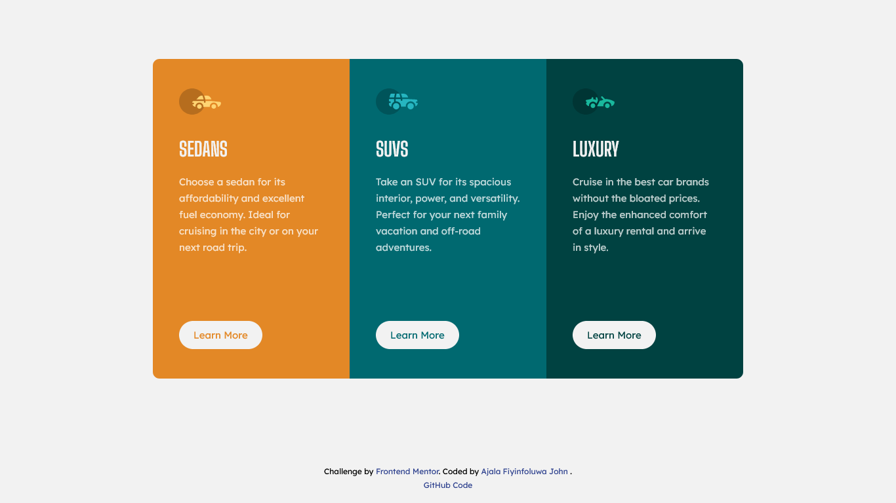
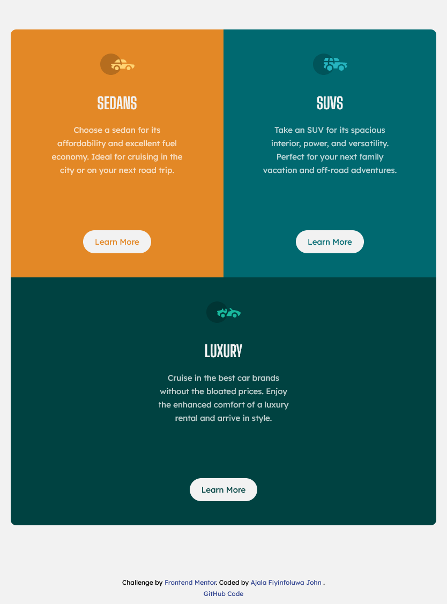
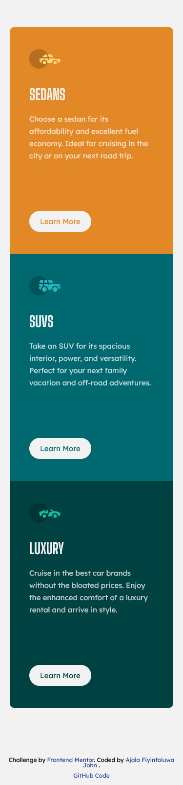

# Frontend Mentor - 3-column preview card component solution

This is a solution to the [3-column preview card component challenge on Frontend Mentor](https://www.frontendmentor.io/challenges/3column-preview-card-component-pH92eAR2-). Frontend Mentor challenges help you improve your coding skills by building realistic projects.

## Table of contents

- [Overview](#overview)
  - [The challenge](#the-challenge)
  - [Screenshot](#screenshot)
    - [Desktop](#desktop)
    - [Mobile](#mobile)
    - [Tablet](#tablet)
  - [Links](#links)
- [My process](#my-process)
  - [Built with](#built-with)
  - [Continued development](#continued-development)
- [Author](#author)
- [Acknowledgments](#acknowledgments)

**Note: Delete this note and update the table of contents based on what sections you keep.**

## Overview

### The challenge

Users should be able to:

- View the optimal layout depending on their device's screen size
- See hover states for interactive elements

### Screenshot

#### Desktop

#### Tablet

#### Mobile

### Links

- Solution URL: [GitHub code](https://github.com/kodaas/3-column-card_html_css)
- Live Site URL: [Live Site](https://kodaas.github.io/3-column-card_html_css/)

## My process

### Built with

- Semantic HTML5 markup
- CSS custom properties
- Flexbox
- CSS Grid
- Mobile-first workflow

### Continued development

    I would like to improve more on my javascript, and then move to backend using nodejs.

## Author

- Website - [Ajala Fiyinfoluwa John](https://github.com/kodaas)
- Frontend Mentor - [@Ajala-John](https://www.frontendmentor.io/profile/Ajala-John)
- Twitter - [@_kodaas](https://twitter.com/_kodaas)

## Acknowledgements

I give acknowledgement to [Freecodecamp](https://freecodecamp.org): This is where i learnt all my front end skills. Their curriculum is easy to follow and they have tasking project and exercises at the end of every lecture. Thank you for helping me.

I also want to give acknowledgement to a friend [@VictorUdUsoro](https://twitter.com/VictorUdUsoro) who assisted me while learning programing. Thank you so mush.
